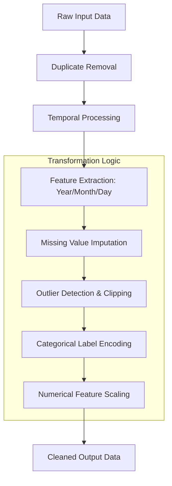

# Technical Architecture

This document details the internal logic and data flow of the DeepClean pipeline.

## Pipeline Flowchart

The diagram below illustrates the sequential order of operations executed by the `.clean()` method. This order is strategically chosen to ensure that feature engineering (dates) occurs before statistical imputation and scaling.

## Module Descriptions

### 1. Temporal Processing
Converts object-based timestamps into `datetime64` objects and generates four derivative features. This prevents information loss and allows models to capture seasonality.

### 2. Statistical Imputation
Uses the `SimpleImputer` engine. By default, it applies the mean of the column to fill null entries. This ensures the dataset maintains its shape without dropping critical rows.

### 3. Outlier Management
Implements a Z-score threshold (default = 3.0). Values exceeding this threshold are not deleted but are "clipped" (Winsorized) to the threshold value. This preserves the data's volume while reducing the variance caused by noise.

### 4. Normalization
Final stage before output. It centers the data around zero with a unit standard deviation (StandardScaler). This is mandatory for distance-based algorithms like KNN, SVM, or Linear Regression.
